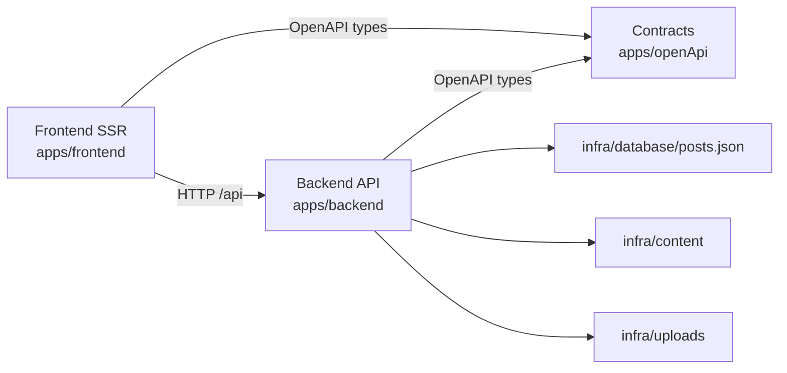

# eto-ne-e123x Monorepo

## Repository Overview

This monorepo consists of three working apps and infrastructure directories:

- Frontend (SSR): Vue 3 + Express
- Backend API: Express + TypeScript
- Contracts: OpenAPI 3.0 (source of truth for API)
- Infra: local data, content, and uploaded files

Detailed docs for each part:

- [apps/frontend/README.md](apps/frontend/README.md)
- [apps/backend/README.md](apps/backend/README.md)
- [apps/openApi/README.md](apps/openApi/README.md)

## Monorepo Structure

```text
.
├── apps/
│   ├── frontend/     # SSR UI app
│   ├── backend/      # API and file/post handling
│   └── openApi/      # OpenAPI contracts
├── infra/
│   ├── content/      # source content for explorer
│   ├── database/     # JSON tables (posts.json)
│   └── uploads/      # uploaded post attachments
└── deploy/           # deployment artifacts directory (currently empty)
```

## Requirements

- Node.js 20+
- npm

## Quick Start (Local)

Open 2 terminals and run backend + frontend in parallel.

### 1) Backend

```bash
cd apps/backend
npm install
cp .env.example .env
npm run dev
```

Backend usually runs at `http://127.0.0.1:4000`.

### 2) Frontend

```bash
cd apps/frontend
npm install
cp .env.dev.example .env
npm run dev
```

Frontend usually runs at `http://127.0.0.1:5173`.

### 3) Contracts (optional but recommended)

```bash
cd apps/openApi
npm install
npm run lint
npm run bundle
```

## How Components Connect



## Unified Change Workflow

If API changes:

1. Update contract in [apps/openApi/openapi](apps/openApi/openapi).
2. Validate contract:
  - `cd apps/openApi && npm run lint`
  - `cd apps/openApi && npm run bundle`
3. Regenerate types:
  - `cd apps/backend && npm run generate:openapi`
  - `cd apps/frontend && npm run generate:openapi`
4. Adapt backend/frontend to new types and behavior.

If only UI changes (no API contract changes):

1. Work in [apps/frontend](apps/frontend).
2. Run `npm run typecheck` and `npm run lint`.

If only server logic changes (no contract changes):

1. Work in [apps/backend](apps/backend).
2. Run `npm run typecheck` and `npm run lint`.

## Useful Commands

Backend:

- `cd apps/backend && npm run dev`
- `cd apps/backend && npm run typecheck`
- `cd apps/backend && npm run lint`

Frontend:

- `cd apps/frontend && npm run dev`
- `cd apps/frontend && npm run build`
- `cd apps/frontend && npm run typecheck`
- `cd apps/frontend && npm run lint`

Contracts:

- `cd apps/openApi && npm run lint`
- `cd apps/openApi && npm run bundle`
- `cd apps/openApi && npm run preview -- openapi/openapi.yaml`

## Environment Files

- Backend: [apps/backend/.env.example](apps/backend/.env.example)
- Frontend dev: [apps/frontend/.env.dev.example](apps/frontend/.env.dev.example)
- Frontend prod: [apps/frontend/.env.prod.example](apps/frontend/.env.prod.example)
- Frontend test: [apps/frontend/.env.test.example](apps/frontend/.env.test.example)

## Current Infra State

- [infra/database/posts.json](infra/database/posts.json) is used as posts table.
- [infra/content](infra/content) is used by folder-data API endpoint.
- [infra/uploads](infra/uploads) stores uploaded post attachments.

## Notes

- There is no root package.json; commands are run per app package.
- For development, running backend and frontend simultaneously is usually enough.
